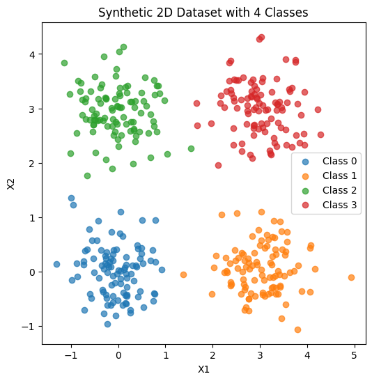
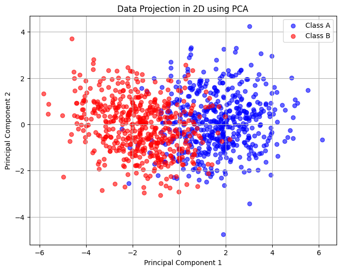
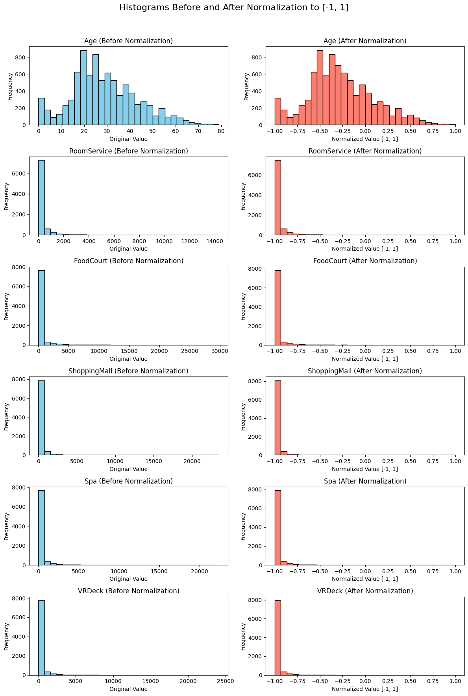

!!! success inline end "Deadline and Submission"

    :date: 05.sep (friday)
    
    :clock1: Commits until 23:59

    :material-account: Individual

    :simple-github: Submission the GitHub Pages' Link (yes, **only** the link for pages) via [insper.blackboard.com](https://insper.blackboard.com){:target="_blank"}.


**Activity: Data Preparation and Analysis for Neural Networks**

This activity is designed to test your skills in generating synthetic datasets, handling real-world data challenges, and preparing data to be fed into **neural networks**.

***

## Exercise 1

### **Exploring Class Separability in 2D**

Understanding how data is distributed is the first step before designing a network architecture. In this exercise, you will generate and visualize a two-dimensional dataset to explore how data distribution affects the complexity of the decision boundaries a neural network would need to learn.

### **Instructions**

1.  **Generate the Data:** Create a synthetic dataset with a total of 400 samples, divided equally among 4 classes (100 samples each). Use a Gaussian distribution to generate the points for each class based on the following parameters:
    * **Class 0:** Mean = $[2, 3]$, Standard Deviation = $[0.8, 2.5]$
    * **Class 1:** Mean = $[5, 6]$, Standard Deviation = $[1.2, 1.9]$
    * **Class 2:** Mean = $[8, 1]$, Standard Deviation = $[0.9, 0.9]$
    * **Class 3:** Mean = $[15, 4]$, Standard Deviation = $[0.5, 2.0]$
1.  **Plot the Data:** Create a 2D scatter plot showing all the data points. Use a different color for each class to make them distinguishable.
1.  **Analyze and Draw Boundaries:**
    1. Examine the scatter plot carefully. Describe the distribution and overlap of the four classes.
    1. Based on your visual inspection, could a simple, linear boundary separate all classes?
    1. On your plot, sketch the decision boundaries that you think a trained neural network might learn to separate these classes.

***

## Answer:

Data generation and plot:

```python
import numpy as np
import matplotlib.pyplot as plt

# Random seed for reproducibility
np.random.seed(42)

# Parameters
means = [(0, 0), (3, 0), (0, 3), (3, 3)]
stds = [0.5, 0.5, 0.5, 0.5]
n_samples = 100

# Generate data
data = []
labels = []
for i, (mean, std) in enumerate(zip(means, stds)):
    x = np.random.normal(loc=mean[0], scale=std, size=n_samples)
    y = np.random.normal(loc=mean[1], scale=std, size=n_samples)
    data.append(np.column_stack((x, y)))
    labels.append(np.full(n_samples, i))

X = np.vstack(data)
y = np.concatenate(labels)

# Plot data
plt.figure(figsize=(6, 6))
for i in range(4):
    plt.scatter(X[y == i, 0], X[y == i, 1], label=f'Class {i}', alpha=0.7)
plt.legend()
plt.title("Synthetic 2D Dataset with 4 Classes")
plt.xlabel("X1")
plt.ylabel("X2")
plt.show()
```



**Analysis:**

Distribution of the points
The dataset has four clear clusters in the 2D space. Each cluster represents one class, with 100 samples each. The points are compact and concentrated around different centers:

- Class 0 (blue): bottom-left area.

- Class 1 (orange): bottom-right area.

- Class 2 (green): top-left area.

- Class 3 (red): top-right area.

There is almost no overlap between the classes, which makes the separation easier.

### Separability
In this case, the classes are linearly separable. A vertical line (around x = 1.5) could separate the left classes (0 and 2) from the right classes (1 and 3). A horizontal line (around y = 1.5) could separate the bottom classes (0 and 1) from the top classes (2 and 3).
With these two simple boundaries, we can isolate the four regions.

### Decision boundaries from a neural network
If we train a neural network on this dataset, it would probably learn straight boundaries, close to vertical and horizontal lines. This happens because the clusters are well-formed and symmetric. The decision regions would look like four quadrants, each one corresponding to a class.


## Exercise 2

### **Non-Linearity in Higher Dimensions**

Simple neural networks (like a Perceptron) can only learn linear boundaries. Deep networks excel when data is not linearly separable. This exercise challenges you to create and visualize such a dataset.

### **Instructions**

1.  **Generate the Data:** Create a dataset with 500 samples for Class A and 500 samples for Class B. Use a multivariate normal distribution with the following parameters:

    * **Class A:**

        Mean vector:

        $$\mu_A = [0, 0, 0, 0, 0]$$

        Covariance matrix:

        $$
        \Sigma_A = \begin{pmatrix}
        1.0 & 0.8 & 0.1 & 0.0 & 0.0 \\
        0.8 & 1.0 & 0.3 & 0.0 & 0.0 \\
        0.1 & 0.3 & 1.0 & 0.5 & 0.0 \\
        0.0 & 0.0 & 0.5 & 1.0 & 0.2 \\
        0.0 & 0.0 & 0.0 & 0.2 & 1.0
        \end{pmatrix}
        $$

    * **Class B:**

        Mean vector:
            
        $$\mu_B = [1.5, 1.5, 1.5, 1.5, 1.5]$$
        
        Covariance matrix:

        $$
        \Sigma_B = \begin{pmatrix}
        1.5 & -0.7 & 0.2 & 0.0 & 0.0 \\
        -0.7 & 1.5 & 0.4 & 0.0 & 0.0 \\
        0.2 & 0.4 & 1.5 & 0.6 & 0.0 \\
        0.0 & 0.0 & 0.6 & 1.5 & 0.3 \\
        0.0 & 0.0 & 0.0 & 0.3 & 1.5
        \end{pmatrix}
        $$

1.  **Visualize the Data:** Since you cannot directly plot a 5D graph, you must reduce its dimensionality.
    * Use a technique like **Principal Component Analysis (PCA)** to project the 5D data down to 2 dimensions.
    * Create a scatter plot of this 2D representation, coloring the points by their class (A or B).
1.  **Analyze the Plots:**
    1. Based on your 2D projection, describe the relationship between the two classes.
    1. Discuss the **linear separability** of the data. Explain why this type of data structure poses a challenge for simple linear models and would likely require a multi-layer neural network with non-linear activation functions to be classified accurately.

***

### Answer:


Data generation, PCA, and plot:

```python

import numpy as np
import matplotlib.pyplot as plt

# Passo 1: Definir os parâmetros para as distribuições
mu_A = np.array([0, 0, 0, 0, 0])
sigma_A = np.array([
    [1.0, 0.8, 0.1, 0.0, 0.0],
    [0.8, 1.0, 0.3, 0.0, 0.0],
    [0.1, 0.3, 1.0, 0.5, 0.0],
    [0.0, 0.0, 0.5, 1.0, 0.2],
    [0.0, 0.0, 0.0, 0.2, 1.0]
])

mu_B = np.array([1.5, 1.5, 1.5, 1.5, 1.5])
sigma_B = np.array([
    [1.5, -0.7, 0.2, 0.0, 0.0],
    [-0.7, 1.5, 0.4, 0.0, 0.0],
    [0.2, 0.4, 1.5, 0.6, 0.0],
    [0.0, 0.0, 0.6, 1.5, 0.3],
    [0.0, 0.0, 0.0, 0.3, 1.5]
])

# Passo 2: Gerar os dados
num_samples = 500
class_A = np.random.multivariate_normal(mu_A, sigma_A, num_samples)
class_B = np.random.multivariate_normal(mu_B, sigma_B, num_samples)

# Combinar os dados e rótulos
X = np.vstack((class_A, class_B))
y = np.hstack((np.zeros(num_samples), np.ones(num_samples)))

# Passo 3: Reduzir dimensionalidade com PCA (implementação manual)
# Centralizar os dados
X_mean = np.mean(X, axis=0)
X_centered = X - X_mean

# Calcular a matriz de covariância
cov_matrix = np.cov(X_centered.T)

# Calcular autovalores e autovetores
eigenvalues, eigenvectors = np.linalg.eig(cov_matrix)

# Ordenar autovalores em ordem decrescente
idx = np.argsort(eigenvalues)[::-1]
top_eigenvectors = eigenvectors[:, idx[:2]]  # Selecionar os 2 principais autovetores

# Projetar os dados para 2D
X_2d = X_centered @ top_eigenvectors

# Passo 4: Visualizar os dados em 2D
plt.figure(figsize=(8, 6))
plt.scatter(X_2d[:num_samples, 0], X_2d[:num_samples, 1], c='blue', label='Class A', alpha=0.6)
plt.scatter(X_2d[num_samples:, 0], X_2d[num_samples:, 1], c='red', label='Class B', alpha=0.6)
plt.xlabel('Principal Component 1')
plt.ylabel('Principal Component 2')
plt.title('Projeção 2D dos Dados usando PCA')
plt.legend()
plt.grid(True)
plt.show()
```




**Analysis:**

The data is not linearly separable, meaning that it is not possible to draw a hyperplane (line in 2D, plane in higher dimensions) that perfectly divides the classes without significant errors. In the 2D projection, you will see that a straight line cannot separate blue from red without cutting through many points of one class.

This non-linear relationship is a challenge for simple linear models like logistic regression or a single-layer perceptron, which can only learn linear decision boundaries. These models would struggle to classify the data accurately, leading to high error rates.


## Exercise 3

### **Preparing Real-World Data for a Neural Network**

This exercise uses a real dataset from Kaggle. Your task is to perform the necessary preprocessing to make it suitable for a neural network that uses the hyperbolic tangent (`tanh`) activation function in its hidden layers.

### **Instructions**

1.  **Get the Data:** Download the [**Spaceship Titanic**](https://www.kaggle.com/competitions/spaceship-titanic){:target="_blank"} dataset from Kaggle.
2.  **Describe the Data:**
    * Briefly describe the dataset's objective (i.e., what does the `Transported` column represent?).
    * List the features and identify which are **numerical** (e.g., `Age`, `RoomService`) and which are **categorical** (e.g., `HomePlanet`, `Destination`).
    * Investigate the dataset for **missing values**. Which columns have them, and how many?
3.  **Preprocess the Data:** Your goal is to clean and transform the data so it can be fed into a neural network. The `tanh` activation function produces outputs in the range `[-1, 1]`, so your input data should be scaled appropriately for stable training.
    * **Handle Missing Data:** Devise and implement a strategy to handle the missing values in all the affected columns. Justify your choices.
    * **Encode Categorical Features:** Convert categorical columns like `HomePlanet`, `CryoSleep`, and `Destination` into a numerical format. One-hot encoding is a good choice.
    * **Normalize/Standardize Numerical Features:** Scale the numerical columns (e.g., `Age`, `RoomService`, etc.). Since the `tanh` activation function is centered at zero and outputs values in `[-1, 1]`, **Standardization** (to mean 0, std 1) or **Normalization** to a `[-1, 1]` range are excellent choices. Implement one and explain why it is a good practice for training neural networks with this activation function.
4.  **Visualize the Results:**
    * Create histograms for one or two numerical features (like `FoodCourt` or `Age`) **before** and **after** scaling to show the effect of your transformation.

***

Answer:

The spaceship Titanic dataset contains information about passengers on a fictional spaceship. The objective is to predict whether a passenger was transported to another dimension (the `Transported` column) based on various features such as demographics, travel details, and spending on amenities.

**Data Description:**
There are 13 features in the dataset excluding the target variable `Transported`:

- **Numerical Features:** `Age`, `RoomService`, `FoodCourt`, `ShoppingMall`, `Spa`, `VRDeck`
- **Categorical Features:** `HomePlanet`, `CryoSleep`, `Destination`, `VIP`, `Cabin``Transported`
- **Missing Values:** Several columns have missing values, including `Age`, `RoomService`, `FoodCourt`, `ShoppingMall`, `Spa`, `VRDeck`, `HomePlanet`, `CryoSleep`, `Destination`, and `Cabin`.

**Data Preprocessing Steps:**

Categorical features filled based on the most common values in the dataset. Numerical features filled with median values to mitigate the effect of outliers. Categorical features encoded using one-hot encoding. Numerical features normalized to the range [-1, 1].

note: Handled `Cabin` by splitting it into `deck`, `num`, and `side`, then filling missing values with the mode.

converted `Transported` to binary (0 and 1).

**Data Preprocessing:**

```python
import pandas as pd
import numpy as np
import matplotlib.pyplot as plt

# Step 1: Load the dataset
# Note: Replace 'train.csv' with the path to your downloaded Kaggle dataset
data = pd.read_csv('train.csv')

# Step 2: Describe the dataset
print("Dataset Description:")
print("Objective: Predict whether a passenger was transported to an alternate dimension (Transported: True/False).")
print("\nFeatures and their types:")
print(data.dtypes)
print("\nMissing Values:")
print(data.isnull().sum())

# Step 3: Preprocess the data
# Handle missing values
# Numerical columns: Fill with median for robustness to outliers
numerical_cols = ['Age', 'RoomService', 'FoodCourt', 'ShoppingMall', 'Spa', 'VRDeck']
for col in numerical_cols:
    data[col].fillna(data[col].median(), inplace=True)

# Categorical columns: Fill with mode based on predominance
data['HomePlanet'] = data['HomePlanet'].fillna('Earth')  # 54% of data
data['CryoSleep'] = data['CryoSleep'].fillna(False)     # 64% False
data['Destination'] = data['Destination'].fillna('TRAPPIST-1e')  # 69% of data
data['VIP'] = data['VIP'].fillna(False)                 # 97% False

# Handle Cabin: Split into deck, num, side, and fill missing with mode
data[['cabin_deck', 'cabin_num', 'cabin_side']] = data['Cabin'].str.split('/', expand=True)
data['cabin_deck'] = data['cabin_deck'].fillna(data['cabin_deck'].mode()[0])
data['cabin_num'] = data['cabin_num'].fillna(data['cabin_num'].mode()[0])
data['cabin_side'] = data['cabin_side'].fillna(data['cabin_side'].mode()[0])
data = data.drop(columns=['Cabin'])

# Drop irrelevant columns
data = data.drop(['PassengerId', 'Name'], axis=1)

# Encode categorical features
data = pd.get_dummies(data, columns=['HomePlanet', 'Destination', 'cabin_deck', 'cabin_side'], drop_first=True)
data['CryoSleep'] = data['CryoSleep'].astype(int)
data['VIP'] = data['VIP'].astype(int)

# Convert cabin_num to numeric, fill any remaining NaN with median
data['cabin_num'] = pd.to_numeric(data['cabin_num'], errors='coerce')
data['cabin_num'].fillna(data['cabin_num'].median(), inplace=True)

# Convert Transported to binary
data['Transported'] = data['Transported'].astype(int)

# Normalize numerical features to [-1, 1] for tanh activation
def custom_minmax_scaler(data, cols, feature_range=(-1, 1)):
    data_scaled = data.copy()
    for col in cols:
        min_val = data[col].min()
        max_val = data[col].max()
        if max_val != min_val:  # Avoid division by zero
            data_scaled[col] = (data[col] - min_val) / (max_val - min_val) * (feature_range[1] - feature_range[0]) + feature_range[0]
        else:
            data_scaled[col] = 0  # If all values are the same, set to 0
    return data_scaled

data_normalized = custom_minmax_scaler(data, numerical_cols + ['cabin_num'])

# Step 4: Visualize numerical features before and after scaling
data_original = pd.read_csv('train.csv')  # For comparison
colunas_para_visualizar = numerical_cols

fig, axes = plt.subplots(nrows=len(colunas_para_visualizar), ncols=2, figsize=(12, 18))
fig.suptitle('Histograms Before and After Normalization to [-1, 1]', fontsize=16)

for i, col in enumerate(colunas_para_visualizar):
    # Before normalization
    axes[i, 0].hist(data_original[col].dropna(), bins=30, color='skyblue', edgecolor='black')
    axes[i, 0].set_title(f'{col} (Before Normalization)')
    axes[i, 0].set_xlabel('Original Value')
    axes[i, 0].set_ylabel('Frequency')
    
    # After normalization
    axes[i, 1].hist(data_normalized[col], bins=30, color='salmon', edgecolor='black')
    axes[i, 1].set_title(f'{col} (After Normalization)')
    axes[i, 1].set_xlabel('Normalized Value [-1, 1]')
    axes[i, 1].set_ylabel('Frequency')

plt.tight_layout(rect=[0, 0, 1, 0.96])
plt.show()

# Save the preprocessed dataset
data_normalized.to_csv('preprocessed_spaceship_titanic_improved.csv', index=False)
print("\nPreprocessed dataset saved as 'preprocessed_spaceship_titanic_improved.csv'")
```



