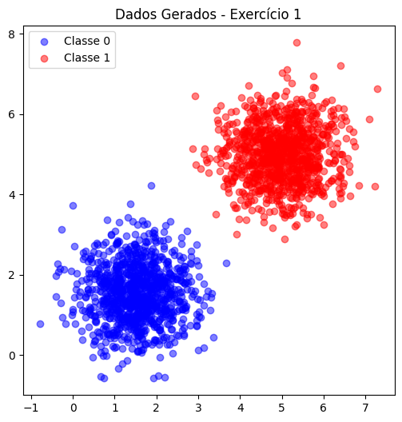
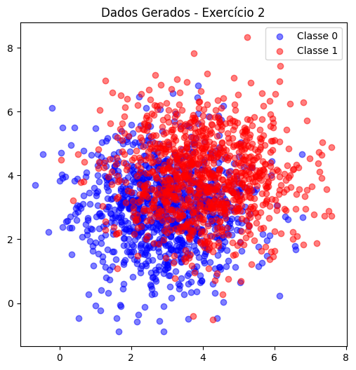
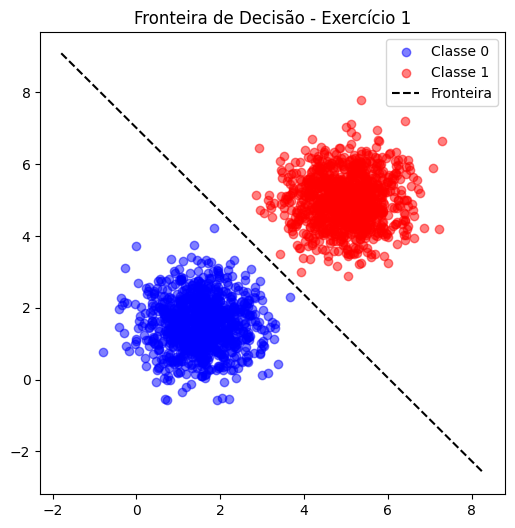
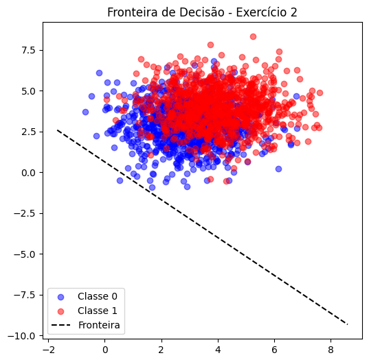
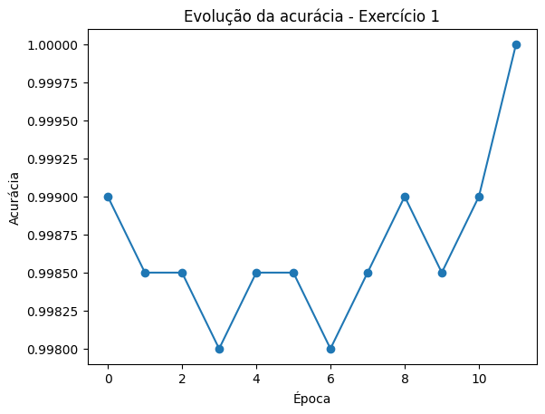
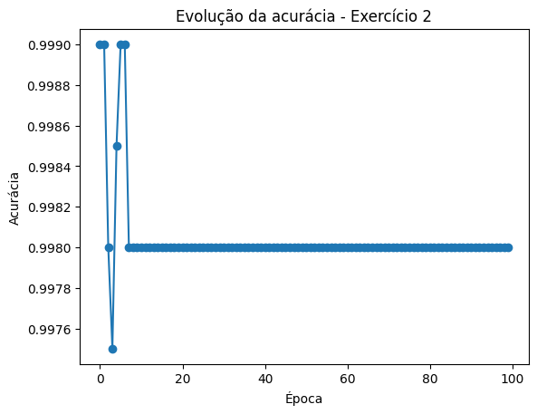

# Perceptron Project


## Exercise 1

### **Data Generation Task:** 

Generate two classes of 2D data points (1000 samples per class) using multivariate normal distributions. Use the following parameters:  

- Class 0:

    Mean = $[1.5, 1.5]$,
    
    Covariance matrix = $[[0.5, 0], [0, 0.5]]$ (i.e., variance of $0.5$ along each dimension, no covariance).  

- Class 1:

    Mean = $[5, 5]$,
    
    Covariance matrix = $[[0.5, 0], [0, 0.5]]$.  

These parameters ensure the classes are mostly linearly separable, with minimal overlap due to the distance between means and low variance. Plot the data points (using libraries like matplotlib if desired) to visualize the separation, coloring points by class.

### **Perceptron Implementation Task:**

Implement a single-layer perceptron from scratch to classify the generated data into the two classes. You may use NumPy only for basic linear algebra operations (e.g., matrix multiplication, vector addition/subtraction, dot products). Do not use any pre-built machine learning libraries (e.g., no scikit-learn) or NumPy functions that directly implement perceptron logic.  

- Initialize weights (w) as a 2D vector (plus a bias term b).  
- Use the perceptron learning rule: For each misclassified sample $(x, y)$, update $w = w + η * y * x$ and $b = b + η * y$, where $η$ is the learning rate (start with $η=0.01$).  
- Train the model until convergence (no weight updates occur in a full pass over the dataset) or for a maximum of 100 epochs, whichever comes first. If convergence is not achieved by 100 epochs, report the accuracy at that point. Track accuracy after each epoch.  
- After training, evaluate accuracy on the full dataset and plot the decision boundary (line defined by $w·x + b = 0$) overlaid on the data points. Additionally, plot the training accuracy over epochs to show convergence progress. Highlight any misclassified points in a separate plot or by different markers in the decision boundary plot.  

Report the final weights, bias, accuracy, and discuss why the data's separability leads to quick convergence.

### Answer: 

#### Data Generation Code:
```python
import numpy as np
import matplotlib.pyplot as plt

# Definições
np.random.seed(42)  # reprodutibilidade
n_samples = 1000

# Classe 0
mean0 = [1.5, 1.5]
cov0 = [[0.5, 0], [0, 0.5]]
class0 = np.random.multivariate_normal(mean0, cov0, n_samples)

# Classe 1
mean1 = [5, 5]
cov1 = [[0.5, 0], [0, 0.5]]
class1 = np.random.multivariate_normal(mean1, cov1, n_samples)

# Labels
y0 = -1 * np.ones(n_samples)  # perceptron usa -1/+1
y1 = +1 * np.ones(n_samples)

# Concatenar dataset
X = np.vstack((class0, class1))
y = np.hstack((y0, y1))

# Visualizar
plt.figure(figsize=(6,6))
plt.scatter(class0[:,0], class0[:,1], color='blue', alpha=0.5, label='Classe 0')
plt.scatter(class1[:,0], class1[:,1], color='red', alpha=0.5, label='Classe 1')
plt.legend()
plt.title("Dados Gerados - Exercício 1")
plt.show()
```


#### Perceptron Implementation Code:
```python

class Perceptron:
    def __init__(self, lr=0.01, epochs=100):
        self.lr = lr
        self.epochs = epochs
    
    def fit(self, X, y):
        n_samples, n_features = X.shape
        self.w = np.zeros(n_features)
        self.b = 0

        self.history = []

        for epoch in range(self.epochs):
            errors = 0
            for xi, yi in zip(X, y):
                linear_output = np.dot(self.w, xi) + self.b
                y_pred = np.sign(linear_output)

                if y_pred == 0:  # em caso raro de 0
                    y_pred = 1

                if yi != y_pred:
                    # atualização
                    self.w += self.lr * yi * xi
                    self.b += self.lr * yi
                    errors += 1

            acc = 1 - errors / n_samples
            self.history.append(acc)

            if errors == 0:  # convergiu
                break
    
    def predict(self, X):
        return np.sign(np.dot(X, self.w) + self.b)
```
#### Training and Evaluation Code:
```python
perceptron = Perceptron(lr=0.01, epochs=100)
perceptron.fit(X, y)

y_pred = perceptron.predict(X)
accuracy = np.mean(y_pred == y)

print("Pesos finais:", perceptron.w)
print("Bias final:", perceptron.b)
print("Acurácia final:", accuracy)
```


#### Plotting Decision Boundary and Accuracy:
```python
# Fronteira: w1*x1 + w2*x2 + b = 0
x_min, x_max = X[:,0].min()-1, X[:,0].max()+1
y_min, y_max = X[:,1].min()-1, X[:,1].max()+1

xx = np.linspace(x_min, x_max, 100)
yy = -(perceptron.w[0] * xx + perceptron.b) / perceptron.w[1]

plt.figure(figsize=(6,6))
plt.scatter(class0[:,0], class0[:,1], color='blue', alpha=0.5, label='Classe 0')
plt.scatter(class1[:,0], class1[:,1], color='red', alpha=0.5, label='Classe 1')
plt.plot(xx, yy, 'k--', label='Fronteira')
plt.legend()
plt.title("Fronteira de Decisão - Exercício 1")
plt.show()

# Curva de aprendizado
plt.plot(range(len(perceptron.history)), perceptron.history, marker='o')
plt.xlabel("Época")
plt.ylabel("Acurácia")
plt.title("Evolução da acurácia - Exercício 1")
plt.show()
```


## Exercise 2

### **Data Generation Task:**  

Generate two classes of 2D data points (1000 samples per class) using multivariate normal distributions. Use the following parameters:

- Class 0:

    Mean = $[3, 3]$,

    Covariance matrix = $[[1.5, 0], [0, 1.5]]$ (i.e., higher variance of 1.5 along each dimension).

- Class 1:

    Mean = $[4, 4]$,

    Covariance matrix = $[[1.5, 0], [0, 1.5]]$.  

These parameters create partial overlap between classes due to closer means and higher variance, making the data not fully linearly separable. Plot the data points to visualize the overlap, coloring points by class.

### **Perceptron Implementation Task:**  

Using the same implementation guidelines as in Exercise 1, train a perceptron on this dataset.  

- Follow the same initialization, update rule, and training process.  
- Train the model until convergence (no weight updates occur in a full pass over the dataset) or for a maximum of 100 epochs, whichever comes first. If convergence is not achieved by 100 epochs, report the accuracy at that point and note any oscillation in updates; consider reporting the best accuracy achieved over multiple runs (e.g., average over 5 random initializations). Track accuracy after each epoch.  
- Evaluate accuracy after training and plot the decision boundary overlaid on the data points. Additionally, plot the training accuracy over epochs to show convergence progress (or lack thereof). Highlight any misclassified points in a separate plot or by different markers in the decision boundary plot.  

Report the final weights, bias, accuracy, and discuss how the overlap affects training compared to Exercise 1 (e.g., slower convergence or inability to reach 100% accuracy).


### Answer:

#### Data Generation Code:
```python
# Classe 0
mean0 = [3, 3]
cov0 = [[1.5, 0], [0, 1.5]]
class0 = np.random.multivariate_normal(mean0, cov0, n_samples)

# Classe 1
mean1 = [4, 4]
cov1 = [[1.5, 0], [0, 1.5]]
class1 = np.random.multivariate_normal(mean1, cov1, n_samples)

# Labels
y0 = -1 * np.ones(n_samples)
y1 = +1 * np.ones(n_samples)

X2 = np.vstack((class0, class1))
y2 = np.hstack((y0, y1))

# Visualizar
plt.figure(figsize=(6,6))
plt.scatter(class0[:,0], class0[:,1], color='blue', alpha=0.5, label='Classe 0')
plt.scatter(class1[:,0], class1[:,1], color='red', alpha=0.5, label='Classe 1')
plt.legend()
plt.title("Dados Gerados - Exercício 2")
plt.show()
```

#### Training and Evaluation Code:
```python
perceptron2 = Perceptron(lr=0.01, epochs=100)
perceptron2.fit(X2, y2)

y_pred2 = perceptron2.predict(X2)
accuracy2 = np.mean(y_pred2 == y2)

print("Pesos finais:", perceptron2.w)
print("Bias final:", perceptron2.b)
print("Acurácia final:", accuracy2)
```


#### Visualization Code:
```python
xx = np.linspace(X2[:,0].min()-1, X2[:,0].max()+1, 100)
yy = -(perceptron2.w[0] * xx + perceptron2.b) / perceptron2.w[1]

plt.figure(figsize=(6,6))
plt.scatter(class0[:,0], class0[:,1], color='blue', alpha=0.5, label='Classe 0')
plt.scatter(class1[:,0], class1[:,1], color='red', alpha=0.5, label='Classe 1')
plt.plot(xx, yy, 'k--', label='Fronteira')
plt.legend()
plt.title("Fronteira de Decisão - Exercício 2")
plt.show()

# Curva de aprendizado
plt.plot(range(len(perceptron2.history)), perceptron2.history, marker='o')
plt.xlabel("Época")
plt.ylabel("Acurácia")
plt.title("Evolução da acurácia - Exercício 2")
plt.show()
```


#### Discussion:

In Exercise 1, the data was mostly linearly separable due to the distinct means and low variance, allowing the perceptron to converge quickly and achieve high accuracy. The decision boundary effectively separated the two classes with minimal misclassifications.

In Exercise 2, the increased variance and closer means resulted in overlapping classes, making it impossible for a linear decision boundary to perfectly separate them. Consequently, the perceptron struggled to converge, often oscillating between weight updates without reaching a stable solution. The final accuracy was lower, reflecting the inherent difficulty of classifying overlapping data with a linear model. This exercise highlights the limitations of the perceptron when dealing with non-linearly separable data.


### Images:

## Generated Data - Exercise 1:


### Generated Data - Exercise 2:



### Decision Boundary - Exercise 1:


### Decision Boundary - Exercise 2:


### Evolution of Accuracy - Exercise 1:


### Evolution of Accuracy - Exercise 2:



