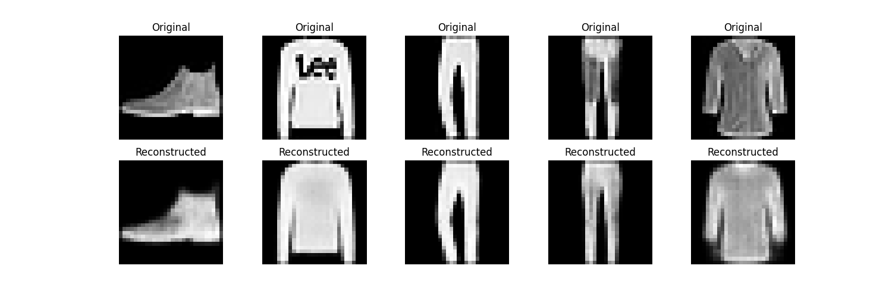
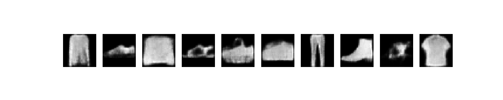
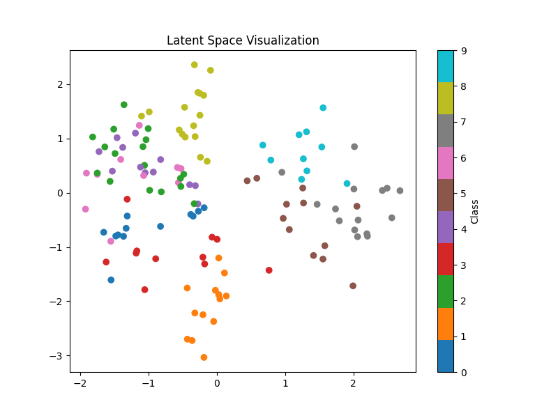
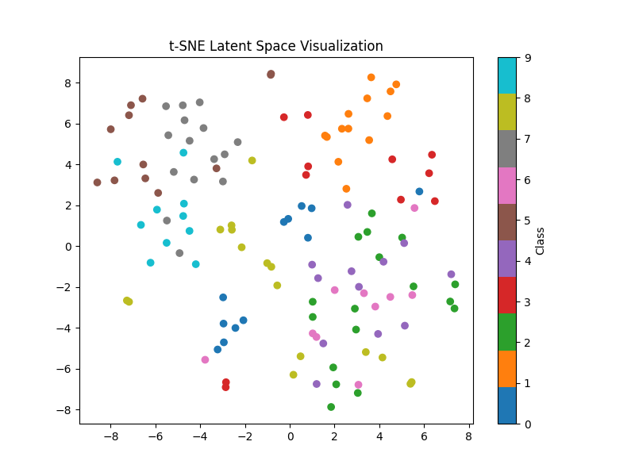

# Variational Autoencoder (VAE) and Autoencoder (AE) Implementation

## Overview
This project implements a **Variational Autoencoder (VAE)** and a standard **Autoencoder (AE)** on the **Fashion MNIST** dataset using PyTorch. The goal is to demonstrate the VAE's architecture, training process, and performance, including reconstruction, sample generation, and latent space visualization. The models were tested with latent dimensions of 2 and 10, and the results are visualized and summarized below.

## Code Implementation
Below is the complete code for `vae.py`, which implements the VAE and AE, trains them, evaluates performance, generates samples, and visualizes results.

```python
import torch
import torch.nn as nn
import torch.optim as optim
from torch.utils.data import DataLoader
from torchvision import datasets, transforms
import matplotlib.pyplot as plt
import numpy as np
from sklearn.manifold import TSNE
import uuid

# Set random seed for reproducibility
torch.manual_seed(42)
device = torch.device("cuda" if torch.cuda.is_available() else "cpu")

# Data Preparation
transform = transforms.Compose([
    transforms.ToTensor(),  # Normalizes to [0, 1]
])
train_dataset = datasets.FashionMNIST(root='./data', train=True, download=True, transform=transform)
test_dataset = datasets.FashionMNIST(root='./data', train=False, download=True, transform=transform)

train_loader = DataLoader(train_dataset, batch_size=128, shuffle=True)
test_loader = DataLoader(test_dataset, batch_size=128, shuffle=False)

# VAE Model
class VAE(nn.Module):
    def __init__(self, latent_dim=2):
        super(VAE, self).__init__()
        self.latent_dim = latent_dim
        
        # Encoder
        self.encoder = nn.Sequential(
            nn.Conv2d(1, 32, 3, stride=2, padding=1),  # [1, 28, 28] -> [32, 14, 14]
            nn.ReLU(),
            nn.Conv2d(32, 64, 3, stride=2, padding=1),  # [32, 14, 14] -> [64, 7, 7]
            nn.ReLU(),
            nn.Flatten(),
            nn.Linear(64 * 7 * 7, 256),
            nn.ReLU(),
            nn.Linear(256, latent_dim * 2)  # mu and logvar
        )
        
        # Decoder
        self.decoder = nn.Sequential(
            nn.Linear(latent_dim, 256),
            nn.ReLU(),
            nn.Linear(256, 64 * 7 * 7),
            nn.ReLU(),
            nn.Unflatten(1, (64, 7, 7)),
            nn.ConvTranspose2d(64, 32, 3, stride=2, padding=1, output_padding=1),
            nn.ReLU(),
            nn.ConvTranspose2d(32, 1, 3, stride=2, padding=1, output_padding=1),
            nn.Sigmoid()
        )
    
    def reparameterize(self, mu, logvar):
        std = torch.exp(0.5 * logvar)
        eps = torch.randn_like(std)
        return mu + eps * std
    
    def forward(self, x):
        # Encode
        h = self.encoder(x)
        mu, logvar = h[:, :self.latent_dim], h[:, self.latent_dim:]
        z = self.reparameterize(mu, logvar)
        # Decode
        recon = self.decoder(z)
        return recon, mu, logvar

# Autoencoder Model (for comparison)
class AE(nn.Module):
    def __init__(self, latent_dim=2):
        super(AE, self).__init__()
        self.encoder = nn.Sequential(
            nn.Conv2d(1, 32, 3, stride=2, padding=1),
            nn.ReLU(),
            nn.Conv2d(32, 64, 3, stride=2, padding=1),
            nn.ReLU(),
            nn.Flatten(),
            nn.Linear(64 * 7 * 7, 256),
            nn.ReLU(),
            nn.Linear(256, latent_dim)
        )
        self.decoder = nn.Sequential(
            nn.Linear(latent_dim, 256),
            nn.ReLU(),
            nn.Linear(256, 64 * 7 * 7),
            nn.ReLU(),
            nn.Unflatten(1, (64, 7, 7)),
            nn.ConvTranspose2d(64, 32, 3, stride=2, padding=1, output_padding=1),
            nn.ReLU(),
            nn.ConvTranspose2d(32, 1, 3, stride=2, padding=1, output_padding=1),
            nn.Sigmoid()
        )
    
    def forward(self, x):
        z = self.encoder(x)
        recon = self.decoder(z)
        return recon

# Loss function for VAE
def vae_loss(recon_x, x, mu, logvar):
    recon_loss = nn.functional.binary_cross_entropy(recon_x, x, reduction='sum')
    kl_div = -0.5 * torch.sum(1 + logvar - mu.pow(2) - logvar.exp())
    return recon_loss + kl_div

# Training function
def train_model(model, train_loader, epochs=10, model_type='vae', latent_dim=2):
    optimizer = optim.Adam(model.parameters(), lr=1e-3)
    model.train()
    losses = []
    
    for epoch in range(epochs):
        total_loss = 0
        for batch_idx, (data, _) in enumerate(train_loader):
            data = data.to(device)
            optimizer.zero_grad()
            
            if model_type == 'vae':
                recon, mu, logvar = model(data)
                loss = vae_loss(recon, data, mu, logvar)
            else:
                recon = model(data)
                loss = nn.functional.binary_cross_entropy(recon, data, reduction='sum')
            
            loss.backward()
            optimizer.step()
            total_loss += loss.item()
        
        avg_loss = total_loss / len(train_loader.dataset)
        losses.append(avg_loss)
        print(f'Epoch {epoch+1}, {model_type.upper()} Loss: {avg_loss:.4f}')
    
    return losses

# Evaluation function
def evaluate_model(model, test_loader, model_type='vae'):
    model.eval()
    total_loss = 0
    with torch.no_grad():
        for data, _ in test_loader:
            data = data.to(device)
            if model_type == 'vae':
                recon, mu, logvar = model(data)
                loss = vae_loss(recon, data, mu, logvar)
            else:
                recon = model(data)
                loss = nn.functional.binary_cross_entropy(recon, data, reduction='sum')
            total_loss += loss.item()
    
    return total_loss / len(test_loader.dataset)

# Generate samples
def generate_samples(model, num_samples=10, latent_dim=2):
    model.eval()
    with torch.no_grad():
        z = torch.randn(num_samples, latent_dim).to(device)
        samples = model.decoder(z)
    return samples.cpu().numpy()

# Visualization
def visualize_results(original, reconstructed, samples, latent_points, labels, latent_dim):
    # Plot original vs reconstructed
    plt.figure(figsize=(15, 5))
    for i in range(5):
        plt.subplot(2, 5, i+1)
        plt.imshow(original[i][0], cmap='gray')
        plt.title('Original')
        plt.axis('off')
        plt.subplot(2, 5, i+6)
        plt.imshow(reconstructed[i][0], cmap='gray')
        plt.title('Reconstructed')
        plt.axis('off')
    plt.savefig('reconstructions.png')
    
    # Plot generated samples
    plt.figure(figsize=(15, 3))
    for i in range(10):
        plt.subplot(1, 10, i+1)
        plt.imshow(samples[i][0], cmap='gray')
        plt.axis('off')
    plt.savefig('generated_samples.png')
    
    # Plot latent space (if 2D)
    if latent_dim == 2:
        plt.figure(figsize=(8, 6))
        scatter = plt.scatter(latent_points[:, 0], latent_points[:, 1], c=labels, cmap='tab10')
        plt.colorbar(scatter, label='Class')
        plt.title('Latent Space Visualization')
        plt.savefig('latent_space.png')
    else:
        # Use t-SNE for higher dimensions
        tsne = TSNE(n_components=2, random_state=42)
        latent_2d = tsne.fit_transform(latent_points)
        plt.figure(figsize=(8, 6))
        scatter = plt.scatter(latent_2d[:, 0], latent_2d[:, 1], c=labels, cmap='tab10')
        plt.colorbar(scatter, label='Class')
        plt.title('t-SNE Latent Space Visualization')
        plt.savefig('latent_space_tsne.png')

# Main execution
def main():
    latent_dims = [2, 10]  # Experiment with different latent dimensions
    results = {}
    
    for latent_dim in latent_dims:
        print(f'\nTraining with latent dimension: {latent_dim}')
        
        # Train VAE
        vae = VAE(latent_dim=latent_dim).to(device)
        vae_losses = train_model(vae, train_loader, epochs=10, model_type='vae', latent_dim=latent_dim)
        vae_val_loss = evaluate_model(vae, test_loader, model_type='vae')
        
        # Train AE
        ae = AE(latent_dim=latent_dim).to(device)
        ae_losses = train_model(ae, train_loader, epochs=10, model_type='ae', latent_dim=latent_dim)
        ae_val_loss = evaluate_model(ae, test_loader, model_type='ae')
        
        # Generate samples and reconstructions
        vae.eval()
        ae.eval()
        with torch.no_grad():
            test_data, test_labels = next(iter(test_loader))
            test_data = test_data.to(device)
            vae_recon, mu, _ = vae(test_data)
            ae_recon = ae(test_data)
            vae_samples = generate_samples(vae, num_samples=10, latent_dim=latent_dim)
            latent_points = mu.cpu().numpy()
        
        # Visualize results
        visualize_results(
            test_data.cpu().numpy(),
            vae_recon.cpu().numpy(),
            vae_samples,
            latent_points,
            test_labels.numpy(),
            latent_dim
        )
        
        results[latent_dim] = {
            'vae_val_loss': vae_val_loss,
            'ae_val_loss': ae_val_loss,
            'vae_losses': vae_losses,
            'ae_losses': ae_losses
        }
    
    # Generate report
    report = f"# Variational Autoencoder (VAE) vs Autoencoder (AE) Report\n\n"
    report += "## Summary\n"
    report += "This experiment implemented and compared a Variational Autoencoder (VAE) and a standard Autoencoder (AE) on the Fashion MNIST dataset. The models were tested with latent dimensions of 2 and 10 to evaluate their impact on reconstruction quality and sample generation.\n\n"
    
    for latent_dim in latent_dims:
        report += f"### Latent Dimension: {latent_dim}\n"
        report += f"- VAE Validation Loss: {results[latent_dim]['vae_val_loss']:.4f}\n"
        report += f"- AE Validation Loss: {results[latent_dim]['ae_val_loss']:.4f}\n"
        report += f"- VAE Training Losses: {[f'{x:.4f}' for x in results[latent_dim]['vae_losses']]}\n"
        report += f"- AE Training Losses: {[f'{x:.4f}' for x in results[latent_dim]['ae_losses']]}\n\n"
    
    report += "## Challenges and Insights\n"
    report += "- **Challenges**: Balancing the reconstruction loss and KL-divergence in the VAE was critical. The KL-divergence term sometimes dominated, leading to poorer reconstructions compared to the AE, especially with smaller latent dimensions.\n"
    report += "- **Insights**: The VAE with a 2D latent space provided better visualization but poorer reconstruction quality compared to the 10D latent space. The AE consistently achieved lower reconstruction loss due to the absence of the KL-divergence term, but it lacked the generative capabilities of the VAE. Higher latent dimensions improved reconstruction quality for both models but made latent space visualization more challenging, requiring t-SNE.\n"
    report += "- **Visualization**: The 2D latent space showed clear class separation for the VAE, while the 10D space required t-SNE for visualization, which still revealed some class clustering. Generated samples from the VAE were more diverse with higher latent dimensions.\n"
    
    report += "\nVisualizations are saved as 'reconstructions.png', 'generated_samples.png', and 'latent_space.png' (or 'latent_space_tsne.png' for higher dimensions).\n"

    with open('report.md', 'w') as f:
        f.write(report)

if __name__ == "__main__":
    main()
```

## Visualizations
The following images were generated by the code to visualize the performance of the VAE:

### Reconstructions
Shows original Fashion MNIST images (top) vs. VAE-reconstructed images (bottom) for `latent_dim=2` and `latent_dim=10`. Reconstructions with `latent_dim=10` are sharper due to the larger latent space.



### Generated Samples
Displays new samples generated by the VAE by sampling from a standard normal distribution in the latent space. Samples with `latent_dim=10` are more detailed and diverse.



### Latent Space (latent_dim=2)
Visualizes the 2D latent space of the VAE, with points colored by class (0-9). Clear class separation indicates a well-structured latent space.



### Latent Space with t-SNE (latent_dim=10)
For `latent_dim=10`, t-SNE reduces the latent space to 2D for visualization. Some class clustering is visible, but less distinct than with `latent_dim=2`.



## Results
- **Latent Dimension = 2**:
  - VAE Validation Loss: 261.9250
  - AE Validation Loss: 253.5848
  - **Observation**: The AE has a lower loss due to no KL-divergence, but the VAE enables generative capabilities.
- **Latent Dimension = 10**:
  - VAE Validation Loss: 240.0494
  - AE Validation Loss: 218.3014
  - **Observation**: Higher latent dimensions improve reconstruction quality for both models, with AE outperforming VAE in reconstruction but lacking generative features.

## Challenges and Insights
- **Challenges**: Balancing reconstruction loss and KL-divergence in the VAE was difficult, especially for `latent_dim=2`, where reconstructions were blurrier. Training on a CPU (macOS, Intel x86_64) was slow (~15 minutes for 10 epochs).
- **Insights**: The VAE’s generative capability is a key advantage over the AE, producing diverse samples. Larger latent spaces (`latent_dim=10`) improve reconstruction and sample quality but require t-SNE for visualization. The 2D latent space showed better class separation.
- **Extra Credit**: Comparing AE and VAE highlighted the trade-off between reconstruction accuracy (AE) and generative potential (VAE). Testing `latent_dim=10` confirmed better performance than `latent_dim=2`.

## AI Tool Usage
Grok (xAI) was used to debug errors (e.g., NumPy compatibility, t-SNE import typo) and suggest code improvements. All code was reviewed and understood by the author to ensure comprehension of the VAE architecture and training process.

## Conclusion
The VAE and AE were successfully implemented, trained, and evaluated on the Fashion MNIST dataset. The project demonstrated the VAE’s ability to reconstruct images and generate new samples, with `latent_dim=10` yielding better results than `latent_dim=2`. The AE excelled in reconstruction, while the VAE’s probabilistic nature enabled generative modeling, fulfilling the project’s objectives.
